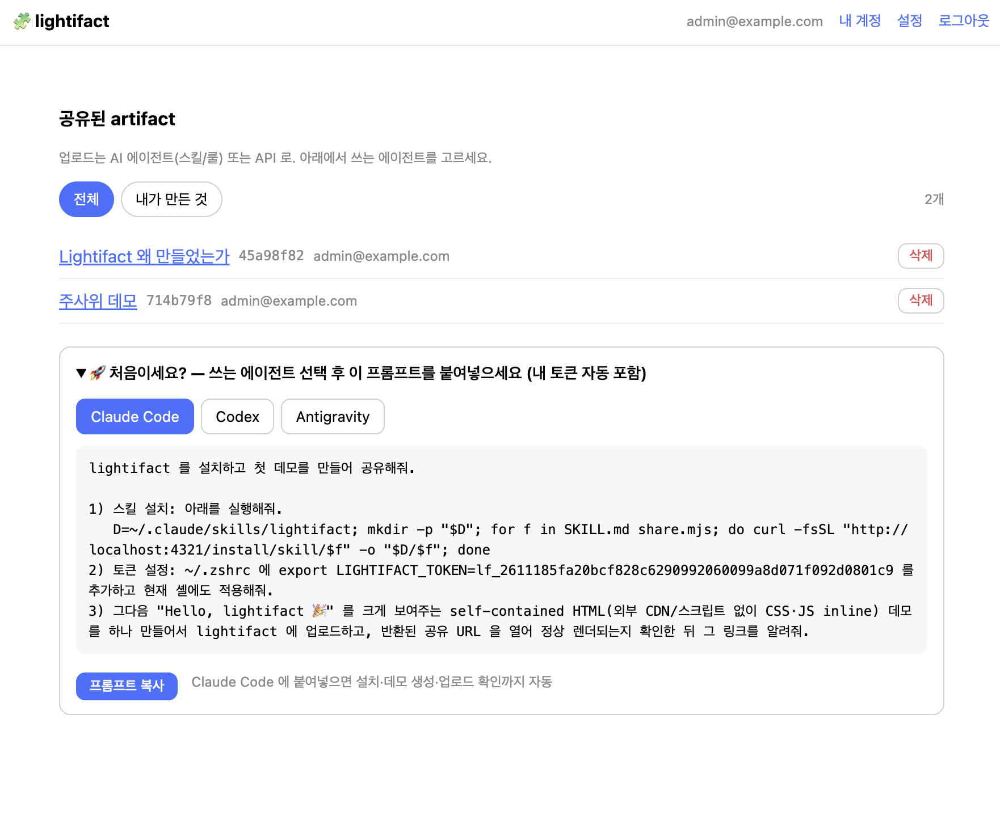

# 🧩 lightifact

**Self-hostable, sandboxed HTML artifact sharing — like Claude Artifacts, on your own infra.**

AI로 만든 self-contained HTML(대시보드·데모·문서)을 올리면, sandbox iframe + strict CSP로 **격리 렌더**해서 링크로 공유한다.



## 왜?
Claude/AI로 HTML 결과물을 뽑는 일은 잦은데, **"이걸 팀과 어디서 공유하지?"** 가 늘 문제였다.
Claude Artifacts는 self-host가 안 되고, CodePen·Gist는 남의 서버, Vercel류는 접근제어가 번거롭다.
**가볍고 · 자체 호스팅 · 로그인 게이트 · AI 에이전트 워크플로에 붙는** 조합이 없어서 만들었다. (light + artifact)

## Quickstart
```bash
npm install
npm run build && npm start        # → http://localhost:4321
# 첫 접속 시 /setup 에서 관리자 계정 생성 → 로그인
```
Docker: `docker build -t lightifact . && docker run -p 4321:4321 -v lightifact-data:/app/data lightifact`

주입할 시크릿 없음 — 서비스 URL은 요청 호스트에서 자동 도출(원하면 `BASE_URL`로 override).

## 어떻게 쓰나
- **웹**: 로그인 → artifact 열람/삭제/공개·비공개 전환. admin은 `/settings`에서 사용자 초대·SSO 설정.
- **AI 에이전트**: 메인 화면 온보딩에서 쓰는 에이전트(Claude Code / Codex / Antigravity)를 고르면
  설치 프롬프트를 준다. 이후 *"이거 lightifact에 공유해줘"* 한 마디면 업로드 + 링크 발급.
- **API**: `POST /artifacts` (Bearer 토큰, `{title, html}`) → `{ url }`. 수정은 `PUT /artifacts/:slug`.

## 주요 설정 (env, 전부 선택)
| 변수 | 설명 |
|---|---|
| `BASE_URL` | 서비스 URL 고정 override (미설정 시 요청 호스트로 자동) |
| `LIGHTIFACT_CONTENT_ORIGIN` | `/raw`를 격리 오리진에서 서빙 (untrusted/공개 배포 시 권장) |
| `DATA_DIR` | SQLite 저장 경로 (기본 `./data`) |

## 보안
임의 HTML을 호스팅하므로 격리가 핵심이다. 모델·위협·하드닝은 **[SECURITY.md](./SECURITY.md)** 참고.
요약: sandbox iframe + strict CSP + HttpOnly 세션. **인터넷/멀티테넌트 배포 시 `LIGHTIFACT_CONTENT_ORIGIN` 필수 권장.**

## 개발
```bash
npm run start:dev      # watch
npm run test:e2e       # e2e 테스트
```

## License
[MIT](./LICENSE)
